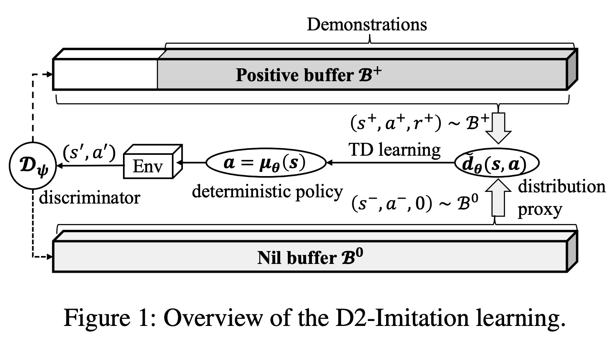
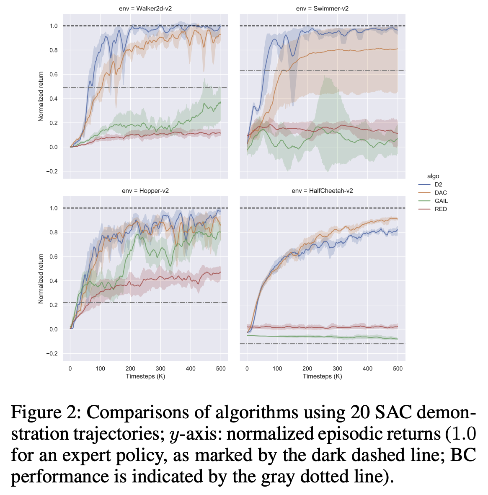
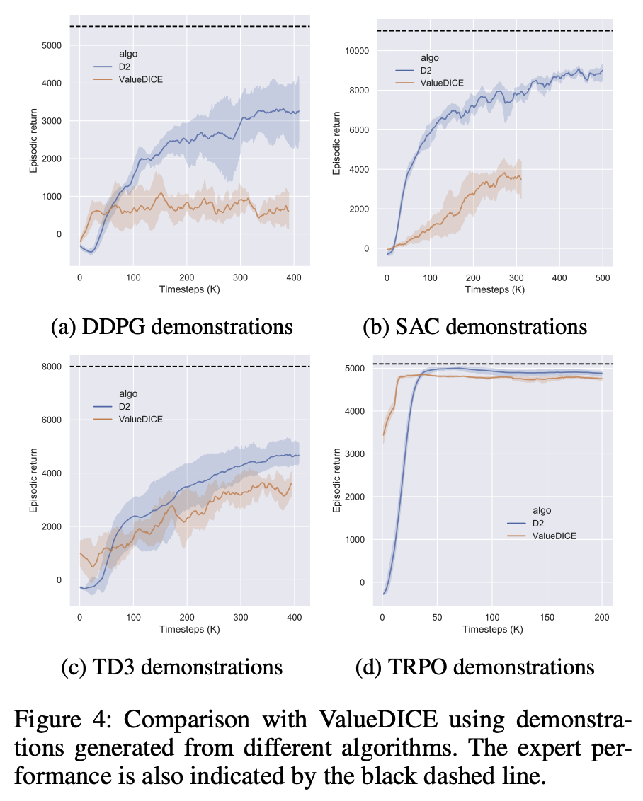
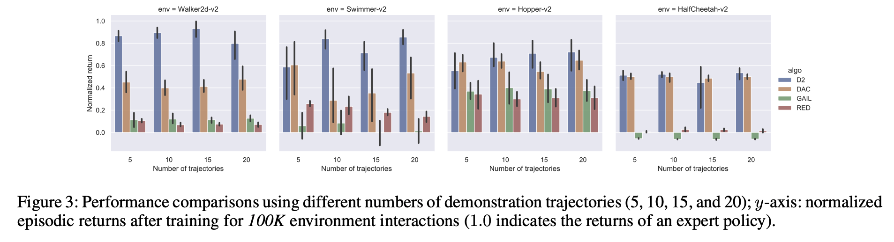

# D2 Imitation
Code repository for the following paper: 

> Deterministic and Discriminative Imitation (D2-Imitation): Revisiting Adversarial Imitation for Sample Efficiency
>
> Mingfei Sun, Sam Devlin, Katja Hofmann, Shimon Whiteson
>
> AAAI 2022, [[pdf]](https://arxiv.org/pdf/2112.06054.pdf). 


### D2-Imitation algorithm overview

<p align="center">
  
</p>

### Overall performance

Compared with adversarial methods           |  Compared with off-policy distribution matching
:-------------------------:|:-------------------------:
  |  

### Overall robustness with different numbers of trajectories

<p align="center">
  
</p>


## How to use
### Building docker image
``` bash 
bash docker_build.sh
```

### Running the code
* Download the demonstration data
``` bash 
cd src
bash download_data-v2.sh # this might take a while
```

* Run in single thread mode
``` bash
cd src 
bash docker_shell.sh # start a docker container
python3 -m baselines.imitation.d2_imitation \
    --seed 0  \
    --env_id HalfCheetah-v2  \
    --expert_path traj_configs-v2/halfcheetah-sac-20.txt  \
    --total_timesteps 500000
```
The experimental results are logged into `log` folder. 

## Citation
Please cite our paper if you find this codebase useful:
```
@article{sun2021deterministic,
  title={Deterministic and Discriminative Imitation (D2-Imitation): Revisiting Adversarial Imitation for Sample Efficiency},
  author={Sun, Mingfei and Devlin, Sam and Hofmann, Katja and Whiteson, Shimon},
  journal={arXiv preprint arXiv:2112.06054},
  year={2021}
}
```
